# 🔗 DEPENDENCY_GRAPH.md — IntelliRAG Module Dependency Map

This document outlines the dependencies, interfaces, critical paths, latency hotspots, and broken coupling across the IntelliRAG codebase.

---

## 1. Feature & Module Dependency Graph

```mermaid
graph TD
    %% Features Layer
    subgraph Features [Feature Layer]
        f_rag[grounded_rag]
        f_search[search_engine]
        f_rerank[smart_reranker]
        f_quiz[quiz_engine]
        f_weakness[weakness_detection]
        f_library[content_library]
        f_ingest[ingestion_pipeline]
        f_course[course_system]
        f_eval[evaluation_engine]
        f_llm[llm_platform]
    end

    %% Modules Layer
    subgraph Modules [Domain Module Layer]
        m_ask[modules/ask_ai]
        m_search[modules/search_engine]
        m_quizzes[modules/quizzes]
        m_flashcards[modules/flashcards]
        m_courses[modules/courses]
        m_weakness[modules/weaknesses]
        m_library[modules/content_library]
        m_upload[modules/upload_pipeline]
        m_router[modules/llm_router]
    end

    %% Core Engines Layer
    subgraph Core [Core Retrieval & Generation Engines]
        c_hybrid[retrieval/hybrid]
        c_mmr[retrieval/mmr]
        c_cfilter[retrieval/context_filter]
        c_embed[rag/embedder]
        c_vector[rag/vector_store]
        c_parser[parser/router]
        c_chunk[chunking/hierarchical]
        c_rerank[reranker/llm_reranker]
        c_ask[rag/user_ask]
        c_client[rag/llm_client]
        c_trust[llm/trust]
        c_prompt[generators/prompts]
        c_quiz[generators/quiz]
        c_content[generators/content]
    end

    %% Dependencies Mappings
    %% Feature -> Modules
    f_rag --> m_ask
    f_search --> m_search
    f_rerank --> c_rerank
    f_quiz --> m_quizzes
    f_quiz --> m_flashcards
    f_weakness --> m_weakness
    f_library --> m_library
    f_ingest --> m_upload
    f_course --> m_courses
    f_llm --> m_router

    %% Modules -> Core Engines
    m_ask --> c_ask
    m_ask --> c_client
    m_search --> c_hybrid
    m_search --> m_router
    m_quizzes --> c_quiz
    m_quizzes --> c_client
    m_flashcards --> c_content
    m_flashcards --> c_client
    m_courses --> c_content
    m_courses --> c_client
    m_weakness --> c_client
    m_library --> c_parser
    m_upload --> c_parser
    m_upload --> c_chunk
    m_router --> c_client

    %% Core Engines Inter-dependencies
    c_ask --> c_hybrid
    c_ask --> c_cfilter
    c_ask --> c_mmr
    c_ask --> c_rerank
    c_ask --> c_client
    c_ask --> c_trust
    c_ask --> c_prompt

    c_quiz --> c_hybrid
    c_quiz --> c_mmr
    c_quiz --> c_client
    c_quiz --> c_prompt

    c_content --> c_hybrid
    c_content --> c_client
    c_content --> c_prompt

    c_rerank --> c_client

    c_hybrid --> c_embed
    c_hybrid --> c_vector
```



---

## 2. Critical Pathways

### A. Ingestion Pathway
```text
Upload Endpoint (upload_document)
   └── pipeline_queue.py (enqueue_document)
       └── background.py (process_document_task)
           └── parser/router.py (extract_text)
               └── chunking/hierarchical.py (split_text)
                   └── indexing/builder.py (build_indices)
                       ├── indexing/vector_index.py (FAISS Index)
                       └── indexing/bm25_index.py (BM25 Index)
```

### B. Retrieval & Q&A Pathway
```text
Ask Endpoint (ask_endpoint)
   └── rag/user_ask.py (ask_ai)
       ├── query/expander.py (expand_query)
       ├── retrieval/hybrid.py (hybrid_retrieve)
       │     ├── FAISS dense search
       │     ├── BM25 lexical search
       │     └── Reciprocal Rank Fusion (RRF)
       ├── retrieval/mmr.py (mmr_filter)
       ├── retrieval/context_filter.py (filter_context)
       ├── reranker/llm_reranker.py (rerank_chunks) [Optional]
       └── rag/llm_client.py (call_llm)
             └── llm/trust.py (compute_confidence)
```

---

## 3. Hotspots, Coupling, and Bottlenecks

### ⚡ Latency Hotspots
1.  **Serial LLM Reranker:** Located in `reranker/llm_reranker.py:rerank_chunks`. It loops through chunk candidates, making sequential blocking `await call_llm` calls. At `rerank_limit = 8`, this takes up to **2.5 to 4 seconds** of blocking network time.
2.  **Synchronous PDF Processing:** In `tasks/background.py`. Heavy libraries like `Docling` or `PDFMiner` are executed. High concurrency of concurrent uploads blocks python thread execution since they perform CPU-intensive parsing without threading offloads.

### ⚠️ Tight Coupling & Broken Routing
1.  **Circular Import Risk:** In `rag/user_ask.py`, a function imports `_ensure_doc_assets_ready` inside its body from `api/routes.py` to check document processing. In turn, `api/routes.py` imports `ask_ai` from `rag/user_ask.py`. 
2.  **Duplicated Retrieval Logic:**
    *   `generators/quiz.py` calls `retrieve_for_task()` which sets parameters.
    *   `rag/user_ask.py` calls `hybrid_retrieve()` directly, bypassing `retrieve_for_task()`.
    *   `search/engine.py` also calls `hybrid_retrieve()` directly with different weights.
3.  **Monolithic Routes file:** `api/routes.py` is a 1628-line monolith containing router logic, prompt building, database schema parsing, cache management, and document state recovery.

### 🔒 Provider Lock-in
*   Historically, all files (`generators/quiz.py`, `generators/content.py`, `rag/user_ask.py`, `reranker/llm_reranker.py`, etc.) import `call_llm` directly from `rag/llm_client.py` which is tied directly to the **Sarvam API**.
*   *Mitigation:* A wrapper routing layer `app.modules.llm_router` has been proposed but is currently composed of stubs, leaving the main system locked to the Sarvam API client.
