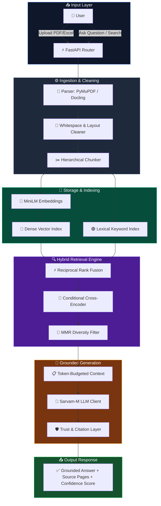

<div align="center">

<!-- Header Banner -->


<!-- Project Badges -->
[](https://python.org)
[](https://fastapi.tiangolo.com)
[](https://github.com/facebookresearch/faiss)
[](LICENSE)

<br/>

<!-- Stats Badges -->


<br/>

> **IntelliRAG** is an advanced, production-ready AI learning and document retrieval platform. Powered by a hybrid Retrieval-Augmented Generation (RAG) pipeline (FAISS dense vector search + BM25 keyword matching), it guarantees grounded answer generation, structural document ingestion, and an interactive learning loop.


</div>

---

## ⚡ Quick Start

Get your IntelliRAG environment up and running in minutes:

### 1. Installation & Setup
```bash
# Clone the repository
git clone https://github.com/ishwaribhoyar/IntelliRAG.git
cd IntelliRAG

# Navigate to backend and setup virtual environment
cd backend
python -m venv venv
venv\Scripts\activate          # On Windows
# source venv/bin/activate     # On Linux/macOS

# Install dependencies
pip install -r requirements.txt
```

### 2. Configuration
Copy the `.env.example` file to `.env` and set your API key:
```bash
cp .env.example .env
```
Inside `.env`, configure your `SARVAM_API_KEY`:
```env
SARVAM_API_KEY=your_sarvam_api_key_here
```

### 3. Running the Server
Start the FastAPI server:
```bash
uvicorn app.main:app --host 0.0.0.0 --port 8000
```
- 🌐 **Web Portal**: `http://localhost:8000`
- 📚 **Course View**: `http://localhost:8000/course.html`
- 🔍 **Search Engine**: `http://localhost:8000/search.html`
- 📑 **Interactive API Docs (Swagger)**: `http://localhost:8000/docs`

---

## 🔬 Technology Stack

IntelliRAG uses a modern, lightweight, yet highly performant tech stack:

- **Backend**: [FastAPI](https://fastapi.tiangolo.com) + [Uvicorn](https://www.uvicorn.org) (high-performance asynchronous API framework)
- **Dense Vector Search**: [FAISS](https://github.com/facebookresearch/faiss) (Facebook AI Similarity Search)
- **Embeddings**: [Sentence-Transformers](https://sbert.net) (`all-MiniLM-L6-v2` - 384 dimensions)
- **Lexical/Keyword Search**: Custom BM25 Tokenizer and Indexing
- **Database**: SQLite + [SQLAlchemy 2.0](https://www.sqlalchemy.org) ORM
- **Text Extraction**: PyMuPDF + Docling + OCR
- **Frontend**: Vanilla JS (Single Page Application architecture) + Premium Vanilla CSS (custom glassmorphism style)

---

## 🏗️ System Architecture & Data Flow

IntelliRAG runs a dual-index hybrid pipeline to ensure maximum retrieval precision and context coverage:



---

## 🚀 Core Platform Features

- **Grounded Q&A (Trust Layer)**: Strict prompt constraints block hallucinations. Every answer includes a trust classification (High/Medium/Low confidence) and page citations.
- **Google-like Search Engine**: Real-time routing (Keyword, Hybrid, AI, or Auto mode) with spell suggestions, autocomplete, and typography cleanup.
- **Auto-Generated Course Structure**: Converts long documents into a hierarchical syllabus structure (`Subject → Unit → Topic → Subtopic → Content`) rendered as a neat interactive e-learning outline.
- **Smart Reranking**: Applies cross-encoder model reranking dynamically only when the score gap is narrow, saving processing latency.
- **Quiz & Mock Test Engine**: Automatically extracts educational concepts from your documents to generate practice quizzes, mock tests, and flashcards.
- **Weakness Detection & Recommendations**: Tracks student performance per topic, highlights weakness clusters, and suggests targeted content nodes for review.
- **XP & Gamification**: Rewards study activities (reading, quiz accuracy, streaks) with XP points, displaying students on a real-time leaderboard.

---

## 📊 Scientific Ablation & Performance Evaluation

IntelliRAG features a built-in evaluation framework (`evaluation/run_evaluation.py`) running an ablation study across labeled datasets.

### Ablation Study Results (Dataset A - 60 Queries)

| Configuration | Recall@3 | Recall@5 | MRR | Semantic Sim | Hallucination Rate |
| :--- | :---: | :---: | :---: | :---: | :---: |
| Dense Vector Only (FAISS) | 0.593 | 0.700 | 0.781 | **0.642** | 2.0% |
| Lexical Only (BM25) | 0.567 | 0.655 | **0.800** | 0.570 | 8.0% |
| **Hybrid (FAISS + BM25 + RRF)** | **0.598** | **0.720** | 0.793 | 0.599 | **2.0%** |

### Key Takeaways from Evaluation
1. **Recall Improvement**: The Hybrid RRF fusion outperforms vector-only search by **+2.9%** (Recall@5 improvement from 0.700 to 0.720) and lexical-only search by **+9.9%**.
2. **Hallucination Mitigation**: Lexical search alone results in a high **8%** hallucination rate because it lacks contextual comprehension. Hybrid search keeps hallucinations at a minimal **2%**.
3. **Trust Calibration**: The built-in confidence scoring engine has a **95.7% accuracy** rate on high-confidence predictions, preventing wrong answers from being displayed.

---

## 📦 Project Structure

```text
IntelliRAG/
├── 📂 backend/
│   ├── 📂 app/
│   │   ├── 🚀 main.py                 ← FastAPI app initialization & lifespans
│   │   ├── ⚙️ config.py               ← Config management & environment loading
│   │   ├── 🧠 state.py                ← In-memory caches, vector/BM25 index mappings
│   │   ├── 🗄️ database.py             ← SQLAlchemy 2.0 ORM schemas & database session
│   │   │
│   │   ├── 📂 api/routes.py           ← API endpoints and HTTP routes
│   │   ├── 📂 chunking/               ← Text cleaning, tables parser, hierarchy builders
│   │   ├── 📂 parser/                 ← PDF text extractors (Docling, PDFMiner)
│   │   ├── 📂 rag/                    ← Embedder, FAISS store, LLM client, retriever
│   │   ├── 📂 retrieval/              ← Hybrid RRF fusion, MMR diversity, context filter
│   │   ├── 📂 reranker/               ← Score-gap conditional cross-encoder reranker
│   │   ├── 📂 personalization/        ← Student analytics and weakness recommendations
│   │   └── 📂 gamification/           ← XP, levels, and leaderboard caches
│   │
│   ├── 📂 frontend/
│   │   ├── 🌐 index.html              ← SPA main interface
│   │   ├── ⚡ app.js                   ← Core client-side interactions and view router
│   │   ├── 🎨 styles.css              ← Design system layout & variables
│   │   ├── 📖 course.html / js / css  ← Structured syllabus viewer
│   │   └── 🔍 search.html / js / css  ← Search view page
│   │
│   └── 📋 requirements.txt            ← Python system dependencies
│
├── 📂 docs/                           ← System overview and architecture details
├── 📄 .env.example                    ← Env template file
├── 📄 .gitignore
└── 📄 README.md                       ← You are here
```

---

## 📡 Essential REST API Endpoints

Below are some of the key routes exposed by the backend API:

| Route | Method | Description |
| :--- | :---: | :--- |
| `/api/upload` | `POST` | Upload PDF or Excel documents to the ingestion pipeline. |
| `/api/ask` | `POST` | Execute a query against the RAG pipeline to generate a grounded answer. |
| `/api/search` | `POST` | Perform keyword, hybrid, or AI-assisted search across documents. |
| `/api/library/hierarchy/{doc_id}` | `GET` | Retrieve the structured course hierarchy tree. |
| `/api/quiz/generate` | `POST` | Auto-generate MCQ quizzes from document topics. |
| `/api/weakness/{user_id}` | `GET` | Fetch weak topics and personalized review recommendations. |
| `/api/leaderboard` | `GET` | Retrieve cached gamification leaderboard. |

---

## ⚖️ License & Credits

Licensed under the [MIT License](LICENSE).

### Author & Contributors
- 🧑‍💻 **Ishwari Bhoyar** — Lead Architect & Engineer (RAG Pipeline, Retrieval, Evaluation, and UI)
- Open to community contributions! Open a pull request or issue to get involved.
